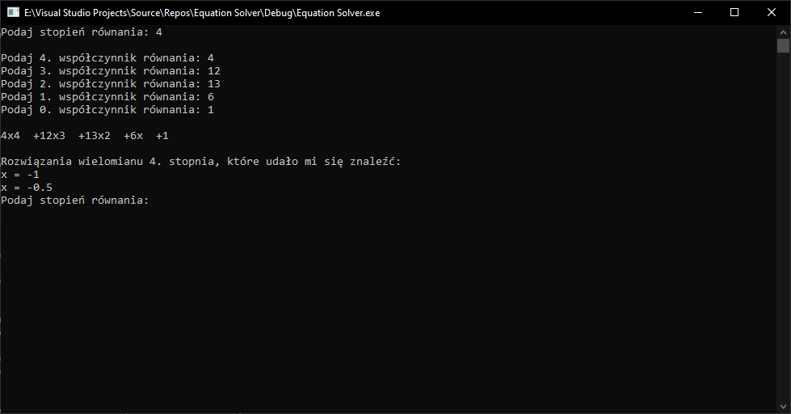
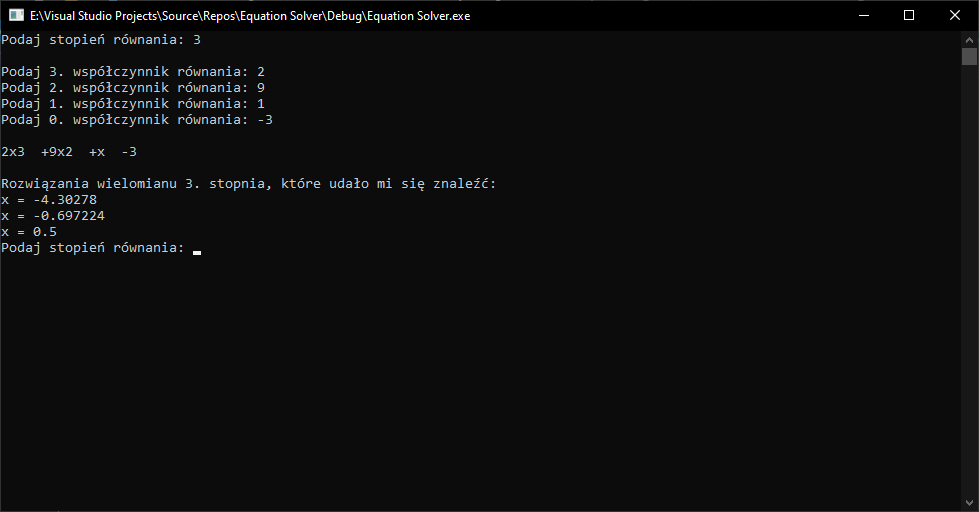

# Equation Solver

## Table of contents
* [General info](#general-info)
* [Screenshots](#screenshots)
* [Technologies](#technologies)
* [Features](#features)
* [Status](#status)
* [Inspiration](#inspiration)
* [Contact](#contact)

## General info
This app allows you to calculate some nth degree mathematical equations.
At the beginning you must give degree of your function.
Next type coefficients of function (in this order: a; b; c; d; ...).

If program will be able to find x, it will write it to you on the screen.

## Screenshots

## Technologies
* Environment - Visual Studio 2019 (v142)
* Language - C++14

## Features
List of features ready and TODOs for future development
* Calculation of linear function
* Calculation of quadratic function
* Calculation of some cubic and higher functions

To-do list:
* Calculating more complicated equations support
* Fixing some bugs

## Status
Project is: _in progress_

## Inspiration
I was inspired to create this app by calculating equations in school and home

## Contact
e-mail: matematyk.tmobile@gmail.com